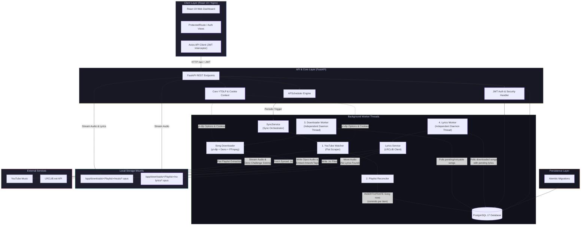

# Architecture Overview

## Architectural Contract

Music-Sync enforces a strict separation of concerns across its core modules according to the contract:

> **SYNC DISCOVERS → DOWNLOADER DOWNLOADS → LYRICS PROCESSES → SCHEDULER TRIGGERS**

No individual background component directly invokes or controls another worker component. Communication across discovery, downloading, and lyrics fetching occurs **exclusively through database state transitions** in PostgreSQL.

---

## High-Level Architecture Diagram

> [!TIP]
> View vector SVG version: [architecture.svg](architecture.svg)

---

## Subsystem Boundaries & Responsibilities

### 1. API & Web Routing Layer (`app/api/`)
- Exposes REST endpoints for auth, dashboard metrics, playlist CRUD, song streaming, background worker controls, and settings management.
- Performs request payload validation using Pydantic models.

### 2. Core Foundation Layer (`app/core/`)
- `app/core/config.py`: Environment configuration via Pydantic BaseSettings.
- `app/core/auth.py`: Password hashing (PBKDF2-HMAC-SHA256) and custom JWT signing/verification.
- `app/core/paths.py`: OS-safe filename sanitization and path resolution helpers (`get_playlist_music_root`, `get_playlist_no_lyrics_root`, `resolve_file_path`).
- `app/core/runtime.py`: Application singletons (`scheduler`, `downloader_worker`, `lyrics_worker`) to prevent circular import issues.
- `app/core/ytdlp.py`: Unified `yt-dlp` options builder and ephemeral Netscape cookie file context manager (`get_cookie_context`).

### 3. Data Persistence Layer (`app/database/`)
- Manages PostgreSQL connections via SQLAlchemy `SessionLocal`.
- Houses ORM models (`Playlist`, `Song`, `DownloadedTrack`, `AppSettings`, `User`).

### 4. Background Workers & Execution Layer
- **`app/watcher/`**: `YouTubePlaylistWatcher` runs flat extractions on YouTube playlists using `yt-dlp`.
- **`app/reconciler/`**: `PlaylistReconciler` diffs discovered playlist entries against the database and commits new `Song` rows per item.
- **`app/downloader/`**: `DownloaderWorker` runs an independent daemon thread continuously polling for `pending` or retry-due `failed` audio downloads.
- **`app/lyrics/`**: `LyricsWorker` runs an independent daemon thread continuously polling for `downloaded` tracks with `pending` lyrics.
- **`app/scheduler/`**: `MusicSyncScheduler` wraps APScheduler to trigger `SyncService.run()` at configurable intervals.
