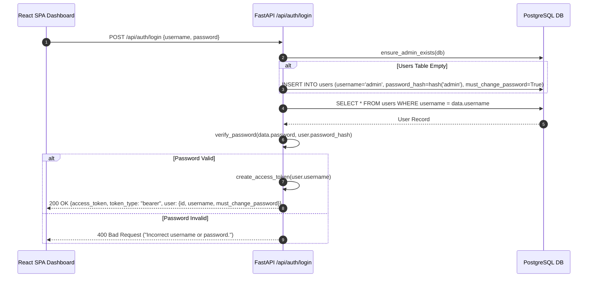

# Authentication and Authorization

## Overview

Music-Sync implements token-based authentication using custom JSON Web Tokens (JWT) and PBKDF2-HMAC-SHA256 password hashing.

---

## 1. Password Hashing Specification (`app/core/auth.py`)

User passwords are hashed using PBKDF2-HMAC-SHA256 with random salts to prevent rainbow table attacks.

- **Algorithm**: PBKDF2 with SHA-256 digest (`hashlib.pbkdf2_hmac`).
- **Iterations**: 100,000 iterations.
- **Salt**: 16 bytes (32 hex characters) generated via `secrets.token_hex(16)`.
- **Stored String Format**: `pbkdf2_sha256$<iterations>$<salt>$<hash_hex>`
- **Verification**: `secrets.compare_digest()` is used to prevent timing side-channel attacks during hash comparisons.

---

## 2. JWT Implementation Specification

The application uses a custom, lightweight JWT implementation without third-party cryptographic dependencies (`PyJWT` or `python-jose`):

- **Algorithm**: HMAC-SHA256 (`alg: HS256`).
- **Secret Key**: `SECRET_KEY = "music-sync-super-secret-key-change-in-prod"` (configured in `app/core/auth.py`).
- **Expiration**: 7 days (`TOKEN_EXPIRE_SECONDS = 604800`).
- **Encoding**: URL-safe base64 encoding without padding (`rstrip(b'=')`).
- **Token Structure**:
  ```text
  base64url(Header) . base64url(Payload) . base64url(HMAC-SHA256 Signature)
  ```
- **Payload Schema**:
  ```json
  {
    "sub": "admin",
    "exp": 1755907200,
    "iat": 1755302400
  }
  ```

---

## 3. Initial Admin Provisioning & Login Flow



---

## 4. Authorization Enforcement & Security Boundaries

> [!WARNING]
> **Backend vs Frontend Security Boundary Discrepancy**:
> - **Backend Protection**: Only two endpoints currently enforce the `get_current_user` FastAPI dependency:
>   - `POST /api/auth/change-password`
>   - `GET /api/auth/me`
> - **Operational Endpoints**: Routes under `/playlists`, `/songs`, `/settings`, `/sync`, and `/dashboard` do **NOT** invoke `get_current_user` in the backend.
> - **Frontend Protection**: The React 19 SPA wraps operational routes in `<ProtectedRoute />` (`dashboard/src/components/ProtectedRoute.jsx`), checking `localStorage` for `music_sync_token` and enforcing mandatory password resets when `must_change_password === true`.
> - **Operational Risk**: Anyone with network access to backend port `8000` can bypass frontend route guards and invoke operational endpoints directly via HTTP.

---

## 5. First-Time Password Change Requirement

When a new user (or auto-seeded `admin`) is created, `must_change_password` is initialized to `true`.

1. Upon login, the API returns `"must_change_password": true` in the user payload.
2. React's `<ProtectedRoute />` component inspects `user.must_change_password`. If `true` and the current path is not `/change-password`, it forcibly redirects the user to `/change-password`.
3. Submitting `POST /api/auth/change-password` updates `password_hash` in PostgreSQL, sets `must_change_password = false`, and allows full access to the dashboard.
