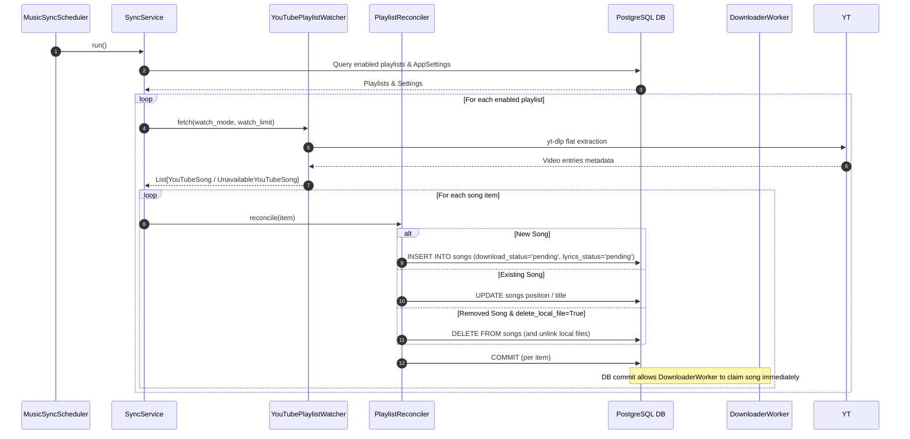
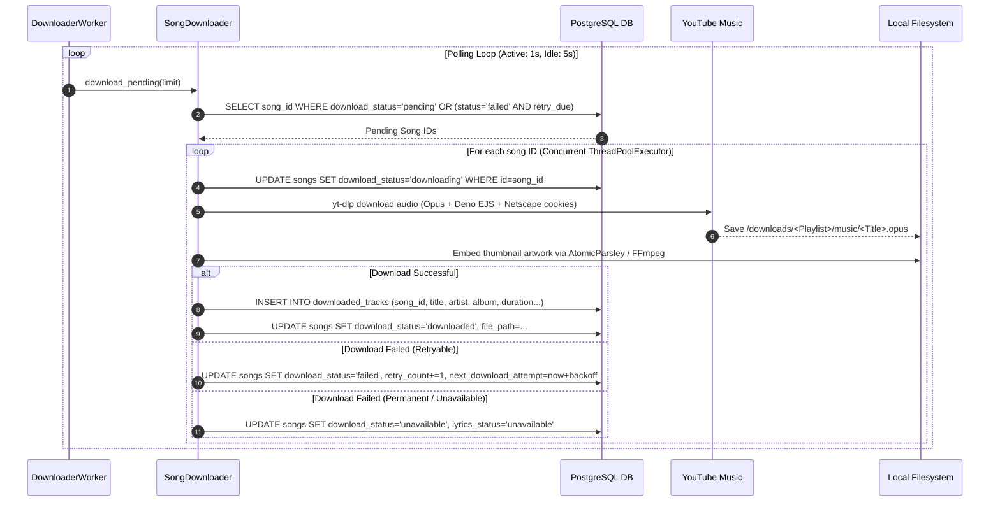
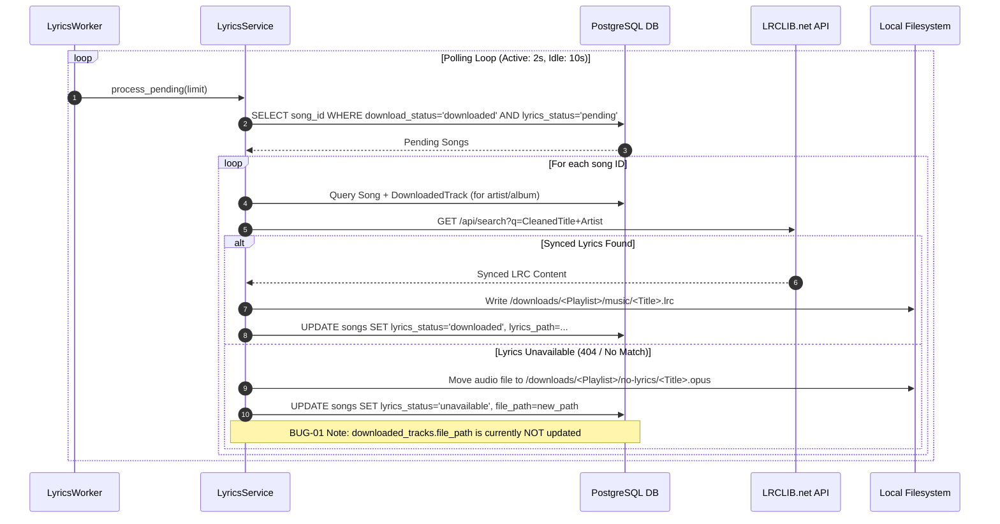

# Data Flow & Workflows

## 1. Playlist Synchronization Workflow

This flow details how new tracks are discovered from YouTube playlists and queued into the database.



---

## 2. Audio Download & Metadata Tagging Flow

This flow details how pending audio download tasks are claimed, processed via `yt-dlp`, and stored as rich track records.



---

## 3. Lyrics Fetching & Reorganization Flow

This flow details how downloaded tracks are processed for synchronized `.lrc` lyrics via LRCLIB.



---

## 4. Reconciler Removal Workflow

This flow details what happens when a video is removed from a YouTube playlist.

```text
[Sync Cycle Scan] -> Detects video missing from YouTube Playlist
        │
        ▼
[PlaylistReconciler._handle_removals]
        │
        ├── IF delete_local_file_on_playlist_removal == True:
        │      1. Unlink audio file from disk (`song.file_path`)
        │      2. Unlink lyrics file from disk (`song.lyrics_path`)
        │      3. DELETE FROM songs WHERE id = song_id (Cascade deletes downloaded_tracks)
        │
        └── IF delete_local_file_on_playlist_removal == False:
               1. Preserve audio file on disk
               2. Preserve lyrics file on disk
               3. DELETE FROM songs WHERE id = song_id ONLY
```
