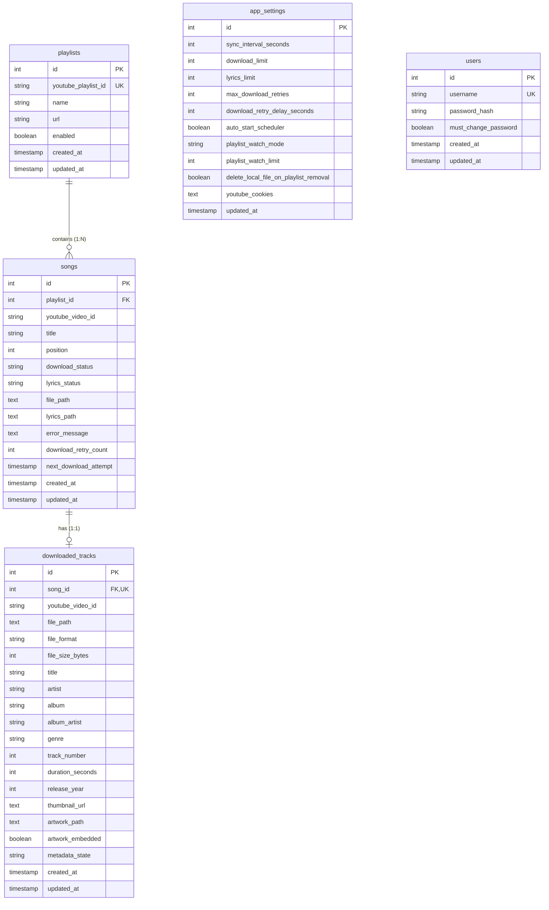

# Database Relationships

## Entity-Relationship (ER) Diagram

---

## Relationship Specifications

### 1. `playlists` → `songs` (One-to-Many)
- **Foreign Key**: `songs.playlist_id` references `playlists.id`.
- **Cascade Rule**: `ON DELETE CASCADE`. Deleting a `Playlist` row automatically deletes all associated `Song` records.
- **ORM Configuration**: `Playlist.songs = relationship("Song", back_populates="playlist", cascade="all, delete-orphan")`.

### 2. `songs` → `downloaded_tracks` (One-to-One)
- **Foreign Key**: `downloaded_tracks.song_id` references `songs.id`.
- **Unique Constraint**: `downloaded_tracks.song_id` is unique (`uq_downloaded_tracks_song_id`), enforcing strict 1:1 mapping.
- **Cascade Rule**: `ON DELETE CASCADE`. Deleting a `Song` row automatically deletes its `DownloadedTrack` record.
- **ORM Configuration**: `Song.downloaded_track = relationship("DownloadedTrack", back_populates="song", uselist=False, cascade="all, delete-orphan")`.

---

## Database Index Catalog

To maintain high query performance during frequent worker polling and REST list queries, the database defines the following indexes:

| Table | Index Name | Type | Indexed Columns | Purpose |
| :--- | :--- | :--- | :--- | :--- |
| `playlists` | `playlists_pkey` | `btree` (UNIQUE) | `id` | Primary Key |
| `playlists` | `ix_playlists_youtube_playlist_id` | `btree` (UNIQUE) | `youtube_playlist_id` | Prevent duplicate playlist URLs |
| `songs` | `songs_pkey` | `btree` (UNIQUE) | `id` | Primary Key |
| `songs` | `uq_songs_playlist_video` | `btree` (UNIQUE) | `(playlist_id, youtube_video_id)` | Prevent duplicate tracks per playlist |
| `songs` | `ix_songs_download_status` | `btree` | `download_status` | Speed up `DownloaderWorker` queue polling |
| `songs` | `ix_songs_lyrics_status` | `btree` | `lyrics_status` | Speed up `LyricsWorker` queue polling |
| `songs` | `ix_songs_playlist_id` | `btree` | `playlist_id` | Speed up playlist track listing |
| `songs` | `ix_songs_youtube_video_id` | `btree` | `youtube_video_id` | Fast video ID lookups |
| `downloaded_tracks`| `downloaded_tracks_pkey` | `btree` (UNIQUE) | `id` | Primary Key |
| `downloaded_tracks`| `uq_downloaded_tracks_song_id` | `btree` (UNIQUE) | `song_id` | Enforce 1:1 relationship with `Song` |
| `downloaded_tracks`| `ix_downloaded_tracks_youtube_video_id` | `btree` | `youtube_video_id` | Fast video metadata queries |
| `users` | `users_pkey` | `btree` (UNIQUE) | `id` | Primary Key |
| `users` | `ix_users_username` | `btree` (UNIQUE) | `username` | Fast user login lookup |
