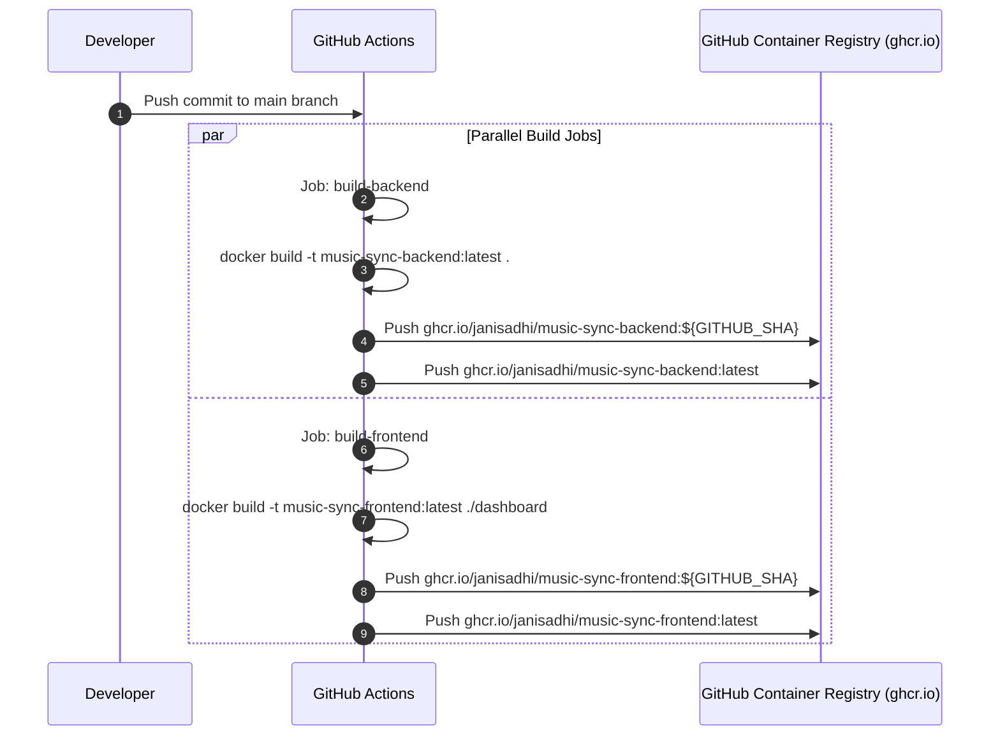

# Deployment & Orchestration

## 1. Docker Compose Stacks

Music-Sync includes two Docker Compose stack definitions tailored for development and production environments.

### Local Development Stack (`docker-compose.yml`)
- Orchestrates 3 containers built from local source code:
  1. `postgres`: PostgreSQL 17 container listening on `127.0.0.1:5432`. Performs healthchecks using `pg_isready`.
  2. `app`: FastAPI backend container depending on healthy `postgres`. Mounts `./app`, `./alembic`, and `./data/downloads`. Listens on `127.0.0.1:8000`.
  3. `dashboard`: Nginx React SPA container depending on `app`. Listens on `127.0.0.1:3000`.

### Production CD Stack (`docker-compose-cd.yaml`)
- Identical network and storage topology to local development, but pulls pre-built image artifacts from GitHub Container Registry (GHCR):
  - `image: ghcr.io/janisadhi/music-sync-backend:latest`
  - `image: ghcr.io/janisadhi/music-sync-frontend:latest`

---

## 2. CI/CD Deployment Pipeline (`.github/workflows/deploy.yaml`)

GitHub Actions automatically builds and publishes container images upon pushing to the `main` branch.

---

## 3. Automated Dependency Updates (`.github/dependabot.yml`)

Dependabot runs weekly automated checks for:
- **Python / Pip**: Checks `requirements.txt` for updates (`chore(deps-python)`).
- **Node.js / npm**: Checks `dashboard/package.json` for updates (`chore(deps-npm)`).
- **Docker**: Checks root and dashboard `Dockerfile` base images (`chore(deps-docker)`).
- **GitHub Actions**: Checks workflow action versions (`chore(deps-ci)`).
